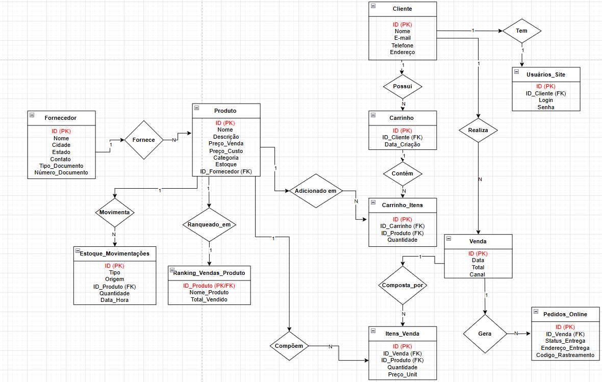

# 🌱 Horta na Porta 

**Projeto Integrador: Administração e Utilização de Banco de Dados**

A Horta na Porta é uma loja física e virtual que une sustentabilidade, comércio local e tecnologia. O projeto simula a implantação de um banco de dados para gerenciar vendas físicas e online de produtos orgânicos, de higiene natural, utensílios sustentáveis e kits de horta doméstica. 

## 👥 Equipe 

- [Bruno Costa Caiado](https://github.com/costacaiado)
- [Felipe Augusto Santinho](https://github.com/felipe-santinho)
- [Isabel Helana Hartmann](https://github.com/belhartmann)
- [Paula Barros Ortiz](https://github.com/paulabortiz)
- [Thais Oliveira dos Santos](https://github.com/thaismarino)

## 👨‍🏫 Orientadora

- Debora Batista da Silva Paulo 

## 🎯 Objetivo do Projeto 

Implementar um banco de dados funcional e seguro para uma empresa fictícia do setor de sustentabilidade e comércio consciente, com foco na organização dos dados, normalização e aplicação prática dos conceitos da disciplina. 

## 🛠️ Tecnologias Utilizadas

- PostgreSQL (via Heroku)
- DBeaver
- dbdiagram.io
- GitHub
- SQL (DDL e DML)

## 📂 Funcionalidades do Sistema 

- **Cadastro de Clientes e Fornecedores**
- **Gerenciamento de Produtos** (orgânicos, sustentáveis, etc.)
- **Controle de Estoque**
- **Venda física e online**
- **Simulação de Carrinho e Itens**
- **Pedidos Online com rastreio**
- **Consultas SQL personalizadas**
- **Relatórios de vendas por canal e produtos mais vendidos**
- **Ranking de vendas**
- **Controle de segurança e acesso via Heroku**

## 🔒 Regras de Negócio e Segurança 

- Toda venda deve conter ao menos um item e estar associada a um cliente.
- Estoque só pode ser reduzido quando há venda confirmada.
- Produtos possuem rastreio de fornecedor e categoria.
- Vendas online exigem login do cliente; físicas não.
- Backups são feitos manualmente pelo DBeaver.

## 🧠 Normalização 

O banco foi normalizado até a **3FN**, garantindo:
- Ausência de dados repetidos.
- Relacionamentos consistentes.
- Integridade referencial com PKs e FKs.

## 📈 Consultas SQL Incluídas 

- Estoque crítico (estoque <= 5).
- Produtos mais vendidos.
- Resumo de vendas por canal.
- Consulta de itens por carrinho.
- Total de vendas por cliente.

## 🗺️ Diagrama Entidade-Relacionamento (DER)

Inclui as seguintes entidades:
- Cliente
- Fornecedor
- Produto
- Carrinho
- Itens do Carrinho
- Venda
- Itens de Venda
- Pedido Online
- Estoque Movimentações
- Ranking de Vendas

## ✅ Conclusão 

O projeto permitiu aplicar, de forma prática, os conhecimentos de modelagem e administração de banco de dados. Além de construir um sistema funcional, a equipe enfrentou desafios reais como estruturação lógica, segurança, consultas eficientes e adaptação ao ambiente de nuvem. O resultado é uma base sólida, funcional e preparada para expansão futura. 

## 📌 Próximos Passos 

- Adicionar painel de métricas com Metabase ou Power BI
- Integração com sistema de pagamentos
- Cadastro de avaliações de clientes

> "Um banco de dados bem estruturado é como uma horta: precisa de planejamento, cuidado e colheita diária." 
